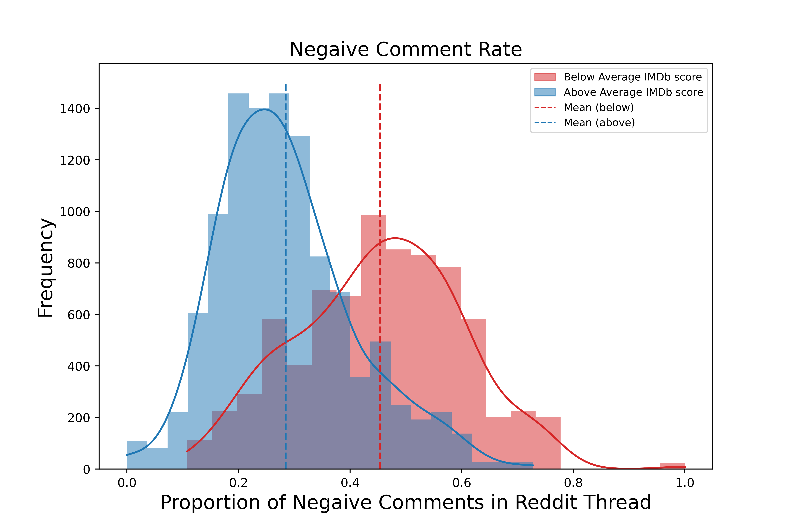

# **NLP Movie Rater** 

## Using Neural Networks and Reddit Comments to Predict Movie Ratings

Flatiron School Data Science: Capstone Project

- **Author**: Zaid Shoorbajee
- **Instructor**: Morgan Jones
- **Pace**: Flex, 40 weeks

[Repository Navigation ⬇️](#nav)

## Premise 

This project aims to predict the IMDb rating of movies using comments from Reddit, as well as understand audiences' common complaints about bad movies. The point is to help a (fictitious) movie studio anticipate the reception of its movies before release and plan accordingly.

The final model chosen for this task is a deep neural network. It takes in text data that has pre-processed with natural language processing methods and outputs an IMDb score.

The final model was able to predict scores with an average error (RMSE) of 0.57 points on IMDb's 1–10 scale.

For the full analysis and modeling, see the project's main [Jupyter Notebook](./index.ipynb).
## Business Understanding 

A movie studio, Cinedistance, wants to identify areas of improvement for its movies before it releases them. After all the hard work of producing a big-budget movie, there are still many decisions to make. Are any scene cuts or [reshoots](https://thedirect.com/article/doctor-strange-2-reshoots-changed-movie) necessary? How much should the studio invest in marketing? Should it release it to a [streaming or theaters](https://www.cnbc.com/2019/11/07/why-netflix-isnt-giving-scorseses-the-irishman-a-wider-release.html)? To make these decisions, it's helpful to know how much audiences will actually like the movie first.

Cinedistance is piloting a program where its movies are released early to a focus group of about 100 average moviegoers. These viewers are asked to sign an NDA, watch the movie, and submit their thoughts about the movie as if they are commenting on an internet comment section. It is also employing a data scientist to use these comments to predict a rating for the movie, like an IMDb score. It also wants insights from this text data about areas of improvement.

The task of the data scientist is to apply natural language processing (NLP) and machine learning (ML) to the focus group's comments in order to predict a movie's IMDb score. These qualitative comments and predicted score can inform Cinedistance's decision-making about the movie's areas of improvement, marketing, and distribution. The studio may decide to do re-shoots, re-edits, or even [kill the movie](https://variety.com/2022/film/news/batgirl-not-released-warner-bros-hbo-max-1235331897/).
___
## Data Understanding 

### Dataset

Movie fans do the type of commentary that Cinedistance is looking for everyday in places like the [Reddit community r/movies](reddit.com/r/movies). On **r/movies**, Reddit users share news and opinions about movies. Additionally, for most major movies that come out, the subreddit hosts an official discussion of the movie. These official discussions contain text data that can be the basis to train an ML model to predict IMDb scores.

Reddit has an API that allows developers to scrape such information. The [PRAW library](https://praw.readthedocs.io/) simplifies this, acting as a wrapper for the API. Using PRAW, I scraped from r/movies the **highest-voted 100 comments of as many official movie discussions still indexed on Reddit**. Some discussions had fewer than 100 comments. I also downloaded [freely available ratings  data from IMDb](https://www.imdb.com/interfaces/) and matched scores to r/movies discussions.

[My data collection process can be seen here.](./compile_and_filter_dataset/)

 The resulting dataset contains:
* 70,693 comments from 922 movies **(main features)**
* Movie title
* Reddit post ID and IMDb ID
* Reddit discussion date
* IMDb average rating **(target variable)**
* Number of IMDb votes
* Movie runtimes
* Genres

### NLP

The core type of data being used for this task is the text of Reddit comments. This is **unstructured data** and requires natural language processing (NLP) techniques in order to be interpretable by a machine learning model, such as a deep neural network. 

Working with natural language is messy; different comments can have many of the same words, but context changes everything. It's easy for people to discern the difference, but for a computer, it's not so simple. To make comments interpretable by a neural network, this project uses the following NLP techniques:

* Tokenization
* Lemmatization
* Removing stop words
* TF-IDF Vectorization
* Part-of-speech tagging
* Sentiment analysis
* Meta-feature extraction

The idea is that converting comments into the signals listed above should help a machine learning model to discern a relationship between the comments and IMDb scores using hidden patterns.

___
## Data Analysis and Feature Engineering 

### The distribution of the 922 IMDb scores in the dataset is as follows:
* **Mean: 6.47**
* **Standard Deviation: 0.89**
* **Minimum: 2.8**
* **Maximum: 8.5**

<!-- Distribution of comments??? -->
### Sentiment Score
For each movie (i.e. each Reddit comment section), I used a pre-trained setniment analysis model to label each comment as positive, negative, or neutral. I then used [Hugging Face](https://huggingface.co/docs/transformers/index) Transformers library, specifically with his model: [cardiffnlp/twitter-roberta-base-sentiment](huggingface.co/cardiffnlp/twitter-roberta-base-sentiment). It is a a roBERTa-base model trained on about 58 million tweets. 

The result is two features: the proportion of positive and negative comments from each comment section.

### Tokenization & Lemmatization

All Reddit comment sections were tokenized and lemmatized in order to standardize them.

**Example:**

Input: *'That fight in the dark only being lit up by gunfire was absolutely incredible.'*

Output: *['that', 'fight', 'in', 'the', 'dark', 'only', 'be', 'light', 'up', 'by', 'gunfire', 'be', 'absolutely', 'incredible', '.']*
### Stop Words

After tokenizing, it's also important to remove stop words, which often don't contribute much signal in modeling context.

The chart below shows the top 50 tokens before stop words were removed. Only three tokens are not in the original stop word list.

Some additional words were added to the list of stop words. Words like "movie" and "film" probably won't add much meaning to a model because of how ubiquitous they are in this corpus.

**This chart shows the top 20 lemmatized tokens, with stop words removed.**

### TF-IDF Vectorization
The tokenized, lemmatized comment sections underwent TF-IDF vectorization. TF-IDF is a measurement that takes into account the 1) token's frequency within the Reddit discussion (term frequency) and 2) how rare it is for the token to appear in a Reddit discussion (inverse document frequency). 

This chart shows a sample of tokens in the discussion of *The Batman* (2022) and their TF-IDF values.

### POS Tagging

Other data that I can vectorize includes each comment's parts-of-speech. I used SpaCy and Scikit-learn to make count vectors parts of speech in comment section. Here are some examples of what I used SpaCy to identify for vectorization:

**Example 1:** "*i can watch batman slowly walking to 4 piano notes all day*"

**Example 2:** "*that fight in the dark only being lit up by gunfire was absolutely incredible.*"

### Meta-features
I was able to engineer more features from each Reddit thread using seemingly arbitrary information from it. Here are the features I engineered:
* Average character count of comment per discussion
* Mean length of lemmas in discussion
* Proportion of lemmas within each discussion that are unique
* Proportion of stop words

### Final Dataset
The preprocessed dataset has 515 features:

* TF-IDF values (500)
* Positive and negative comment rate (2)
* Part-of-speach vectors (9)
* Meta-features (4)
___
## Modeling 

This project ultimately is a **regression** task. An untuned linear regression model was used as a **baseline**. I then used [TensorFlow through the Keras interface](https://www.tensorflow.org/api_docs/python/tf/keras) in order to build various **deep neural networks (DNNs)**. This was an iterative process where I experimented with the number of **layers, regularization, and activation functions** like ReLU and ELU.

The data was split into train, validation, and test sets (before pre-processing, to avoid data leakage). The models were trained on the **training set** and the final model was chosen based on its generalizability and performance on the **validation set**. The models were configured to minimize mean squared error (MSE) and stop running if that hasn't improved in 50 epochs. The final model was evaluated based on its performance on the **test set**.

#### Note: Regression, assumptions, inferences, and predictions

> Often, when predicting a continuous variable such as IMDb score, linear regression is used. This is a basic machine learning task that tries to find an optimal linear relationship between the predictors and the target. Linear regression stipulates several statistical assumptions such as independence of observations, homoscedasticity, no multicollinearity, and others. These assumptions are necessary when needing to make inferences about how individual predictors influence the target. However in a modeling context, there is less of a concern about making such inferences and [more of an emphasis on making accurate predictions](https://projecteuclid.org/journals/statistical-science/volume-16/issue-3/Statistical-Modeling--The-Two-Cultures-with-comments-and-a/10.1214/ss/1009213726.full). For that reason, I haven't checked for any of the assumptions for linear or non-linear regression. Considering how messy NLP is, I highly doubt this data would satisfy them. I am simply interpreting and evaluating how well the models can predict a movie rating. In other words, this is a [black box model approach](https://towardsdatascience.com/machine-learning-interpretability-techniques-662c723454f3).

### Scoring and Evaluation

The IMDb scores the models are trained on have a degree of variability that can't be accounted for 100% of the time with predictions. Two main metrics tell us how well the model is performing:

* **R-squared** tells us what percent of the variability of the target variable the model accounts for.
* **Root mean squared error (RMSE)** measures average distance of predictions from the true target values. RMSE is the same units as the target variable.

### Baseline model:
* The baseline model is a simple, untuned linear regression model using Scikit-learn.

#### Baseline model results:
Training:
* RMSE: 0.2538
* R-squared: 0.9156

Validation:
* RMSE: 0.8071
* R-squared: 0.2930

The baseline performance is not amazing, and there is clear overfitting. But it's impressive to see an untuned linear regression model do this well with a relatively complex dataset. 

### Final model architecture (Model 11):
* Input layer: 515 units
* First hidden layer: 516 units (ELU)
    * Activation: Exponential Linear Unit (ELU)
* Two additional hidden layers. Each layer has 2/3 the number of nodes as the previous
    * Activation: Exponential Linear Unit (ELU)
* Dropout regularizarion: 20% dropout between each layer
* Output layer: 1 unit
    * Activation: Linear
* Optimizer: Adam
* Loss: Mean Squared Error (MSE)

#### Final model results:

Training:
* RMSE: 0.1559
* R-squared: 0.9681

Validation:
* RMSE: 0.5619
* R-squared: 0.6573

🌟 Test: 🌟
* RMSE: 0.5670
* R-squared: 0.6620

Model 11 had a good balance of reducing overfitting and a pushing up R-squared in its validation results, so it was chosen as the final model.

### Interpretation
#### Here's what these results mean about the final model:
* **Loss (RMSE):** On average the model's predictions on unseen data will be about **0.57 points off** of the true IMDb score.
* **Performance (R-squared):** The model is able to account for about **66.2% of the variability** in movie IMDb scores.
___

## Conclusion 

### Recommendations

As discussed earlier, the movie studio Cinedistance wants to use a focus group's comments to predict their movies' IMDb score before official release. With the final model in this project, the focus group's comments would need to be pre-processed in the same way and then fed into the model. 

The model's output is an IMDb score that is expected to be, on average, within 0.57 points of a given movie's future IMDb score if it were released in its current state. The studio can then use that score to inform its decision-making around the movie's marketing, release, and possible changes to the movie.

If the studio wants to know the movie's reception with different demographics (age ranges, gender identities, etc.), it can segement the feedback and get a different IMDb score for each group. This can help decide who to market the movie to.

The studio also has qualitative feedback on its movie alongside the predicted score. If the score is particularly low, the studio can review that feedback that the focus group provided and identify potential improvements. This could lead to re-shoots or re-edits that would hopefully improve the movie. 

Bear in mind that the average IMDb score from the dataset is about 6.5. It's up to the studio how high it wants its movie score to be before release — or how low it would need to be to take drastic measures like scrapping the movie.

### Limitations

The **r/movies** subreddit holds official discussions of many major releases, including big budget blockbusters, international movies, and art house movies. But this is still probably not a representative sample for all movies. Independent, low-budget films don't often get official discussions, for example. Thus, this model, will probably only produce accurate results for large, established movie studios. Additionally the r/movies subreddit has been around since 2008, but I was only able to train on 922 movies discussed between 2016 and 2022, since that was what was available to request through Reddit's API. A larger, more diverse sample of movie discussions to train on would make this model better-suited to rate broader array of movies.

### Future Work

#### Deployment
Now that we have a final model, the next step would be to deploy it. The pre-processing steps would need to be deployed as well. 

This could be a Python file that:
* takes in a list of comments from Cinedistance's focus group about an unreleased movie.
* applies all of the pre-processing functions and transformations in this notebook.
* performs TF-IDF vectorization on the lemmatized discussions, using the vectorizer trained in this notebook.
* scales all features, using the standard scaler trained in this notebook.
* loads the final model from this notebook.
* returns a predicted IMDb score.

<!-- 
    This includes:* cleaning discussions* tokenizing and lemmatizing features* giving discussions a sentiment score* POS tagging* engineering meta-features -->

This Python app could also itself be deployed as a web app to simplify access within the company.

<!-- * Transfer learning?
    * Trailers on YouTube
    * Recommender system -->

#### Use different data

As mentioned in "Limitations", the model is limited by the data that was available from r/movies. There are other websites that can provide a larger amount of similar data.

The website [Letterboxd](https://letterboxd.com/), for example, is a social media website dedicated to reviewing and discussing movies. It has a much thorougher catalog of movies, its own rating system, and an API. Using Letterboxd as an alternative to Reddit for this project could mean training a more robust model on thousands of movies, rather than just over 900.

It could also be worth exploring if a similar approach can be applied to comments on trailers posted to YouTube. When a  studio releases a trailer, it might have several hundred comments within hours. Can those comments be used to predict a movie’s critical reception?
The current dataset and model aren’t configured to be used in this way, but the approach can be tweaked in order to try it.

### For more information

You can see the full analysis in this [Jupyter Notebook](./index.ipynb). A less technnical presentation about the findings can be found [here](./presentation.pdf).

For any questions or feedback, you can contact me [here](https://zaid.fyi/contact/).

### References 
- [Manmohan Singh -- Discover the Sentiment of Reddit Subgroup using RoBERTa Model](https://towardsdatascience.com/discover-the-sentiment-of-reddit-subgroup-using-roberta-model-10ab9a8271b8)
- [Donghyun Suh -- Sentiment Analysis of Reddit Comments on Russia-Ukraine War with Python](https://medium.com/@suhdong21/sentiment-analysis-of-reddit-comments-on-russia-ukraine-war-with-python-a3632994942b)
- [Michael Grogan -- Regression-based neural networks: Predicting Average Daily Rates for Hotels](https://towardsdatascience.com/regression-based-neural-networks-with-tensorflow-v2-0-predicting-average-daily-rates-e20fffa7ac9a)
- [Stacey Ronaghan -- Deep Learning: Which Loss and Activation Functions should I use?](https://towardsdatascience.com/deep-learning-which-loss-and-activation-functions-should-i-use-ac02f1c56aa8)
- [WhyML (YouTube) -- ReLU Variants Explained](https://www.youtube.com/watch?v=ScGmrFBmoVI)
- [Rukshan Pramoditha -- How to Choose the Right Activation Function for Neural Networks](https://towardsdatascience.com/how-to-choose-the-right-activation-function-for-neural-networks-3941ff0e6f9c)
- [Capital One -- Understanding TF-IDF for Machine Learning](https://www.capitalone.com/tech/machine-learning/understanding-tf-idf/)
- [Lars Hulstaert -- Black-box vs. white-box models](https://towardsdatascience.com/machine-learning-interpretability-techniques-662c723454f3)
- [Machine Learning Mastery -- Dropout Regularization in Deep Learning Models With Keras](https://machinelearningmastery.com/dropout-regularization-deep-learning-models-keras/)
- [Machine Learning Mastery -- How to use Learning Curves to Diagnose Machine Learning Model Performance](https://machinelearningmastery.com/learning-curves-for-diagnosing-machine-learning-model-performance/)
- [Leo Breiman -- Statistical Modeling: The Two Cultures](https://projecteuclid.org/journals/statistical-science/volume-16/issue-3/Statistical-Modeling--The-Two-Cultures-with-comments-and-a/10.1214/ss/1009213726.full)

### Repository Navigation 
* [Python Environment](./capstone-env.yml)
* [Data collection and cleaning process](./compile_and_filter_dataset/)
    * Contains several notebooks where the process of collecting data from  Reddit and IMDb is outlined.
* [Data](./data/)
    * Contains this project's dataset through various stages of its compilation. The final dataset is `data_final.csv`.
    * [Modeling data](./data/ready_for_modeling/)
        * Train, Test, and Validation datasets after undergoing all preparation for modeling.
* [Images](./images/)
    * Pictures and graphics used throughout the project.
* [Main project notebook](./index.ipynb)
    * Data is prepared for and undergoes modeling. A more technical version of this page.
* [Presentation](./Presentation.pdf)
    * Non-technical presentation for stakeholders

[**Back to top ⬆️**](#home)